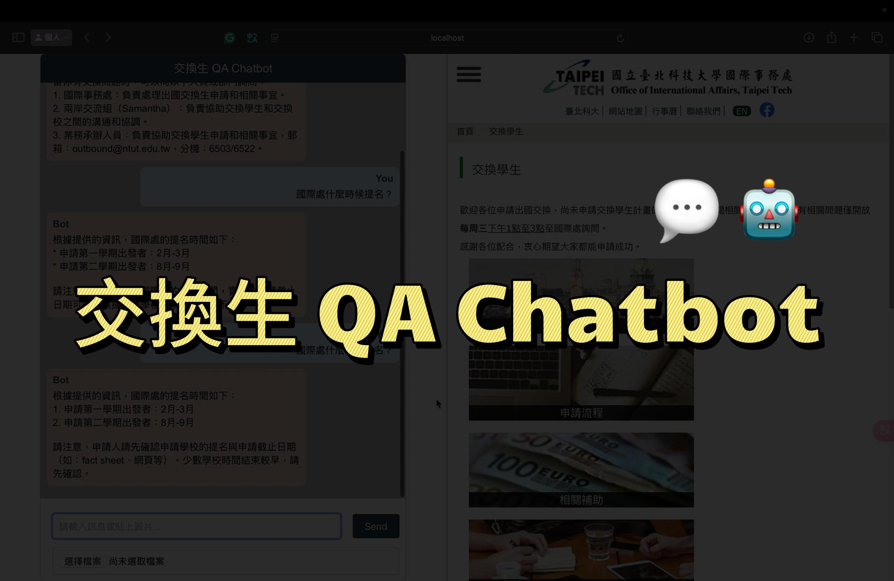
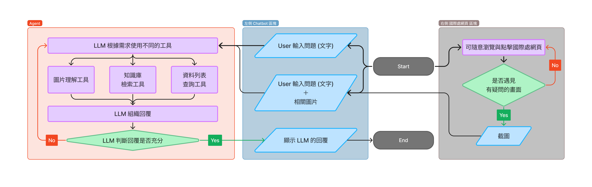

# Exchange_QA_Chatbot
A LLM Application to Facilitate Students' Outbound Exchange Application Process

## Demo

## App Flowchart

## Quick installation
1. `cd Exchange_QA_Chatbot`
2. `pip install -r requirements.txt`

## Quick start
1. `cd Exchange_QA_Chatbot`
2. `python3 prepare_vector_db.py`
3. `python3 agent.py "Please introduce yourself."`

## Web UI installation
1. `cd Exchange_QA_Chatbot/web/chat-interface`
2. `npm install`

## Launch Web UI
### Terminal #1
1. `cd Exchange_QA_Chatbot/web/chat-interface/src`
2. `npx nodemon server.js`

### Terminal #2
1. `cd Exchange_QA_Chatbot/web/chat-interface/src`
2. `npm start`
